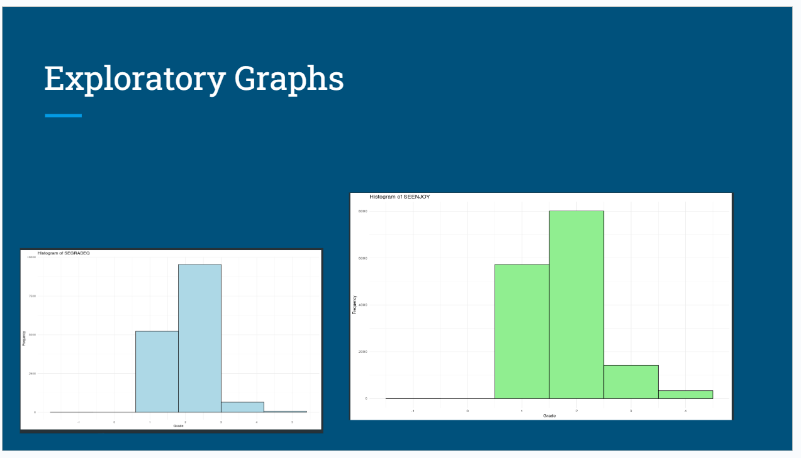
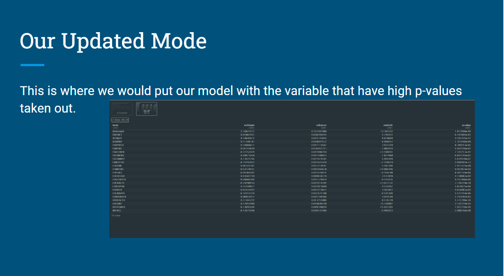
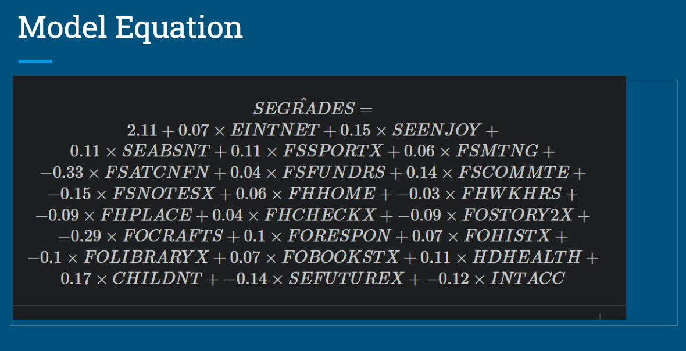
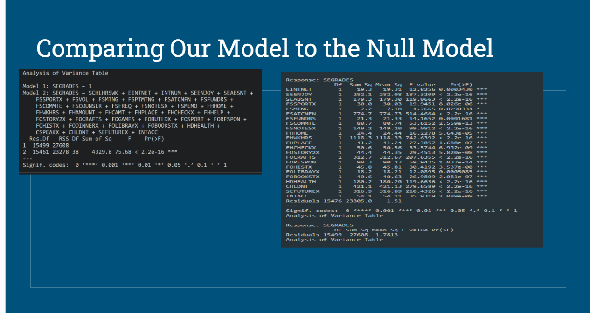

```{r setup, include=FALSE}
knitr::opts_chunk$set(echo = TRUE)
library(tidyverse)
library(tidymodels)
library(forecast)
library(GGally)

```


this is my final project portfolio for CIS 631, in this document I will demonstrate my knowledge of each course objective:


# Course objective"Describe probability as a foundation of statistical modeling, including inference and maximum likelihood estimation"


## Showing "Decribe probablity as a foundation of statistical modeling, including inference and maximum likelihood esitmation":

### for this show I am using Activity 6 which I will also use later in my project:


```{r include=FALSE}


url <- "https://www.openintro.org/data/csv/resume.csv"

resume <- read_csv(url)


```
exploratory analysis on received_callback variable:
```{r}
ggplot(resume, aes(x = received_callback)) +
  geom_bar() +
  labs(x = "Received Callback", y = "Count")


```


By looking at the above graph we can see that a majority of these resumes did not receive callbacks.

```{r}

resume$received_callback <- factor(resume$received_callback, labels = c("No", "Yes"))

table_data <- table(resume$received_callback)
total <- sum(table_data)
percent <- prop.table(table_data) * 100

table_df <- data.frame(
  received_callback = levels(resume$received_callback),
  n = table_data,
  percent = percent
)

print(table_df)

```

looking at the table above our probablity of a "Yes" is only 8% with an odds .08/(1-.08) of roughly 8% also.

we can further explore this data by adding race into it:

Calculating the probability of a randomly selected person percieved as black it would be ~6% and the odds of a randomly selected resume of a person percieved as black being
called back is .06/(1-.06) roughly also 6%
```{r}
# The {tidymodels} method for logistic regression requires that the response be a factor variable
resume <- resume %>% 
  mutate(received_callback = as.factor(received_callback))

resume_mod <- logistic_reg() %>%
  set_engine("glm") %>%
  fit(received_callback ~ race, data = resume, family = "binomial")

tidy(resume_mod) %>% 
  knitr::kable(digits = 3)
```

regression equation :

y= -2.675 + .438*X + E

to simplify this and look at the equation for corresponding to resumes/persons perceived as black we'd right it as:
y= -2.675 + E

the logg-odds would be: -2.675

and the odds they would be called back is 
roughly .069 or exp(-2.675)

and the probability is .064 of getting called back

linear, trying to fit some sort of a line for some link function 
explore the data and then say the data means this so that's why I chose this model


## Telling "Decribe probablity as a foundation of statistical modeling, including inference and maximum likelihood esitmation":

Probability is a foundation of statistical modeling and with probability it guides us when dealing with model selection and assessment. Probability does that by helping us get a better understanding of our data and one way is inference. When dealing with data it is good to utilize inference to help you with model selection and understanding what are data is doing. For example we can infer from different statistics in our data set how the data is distributed and use inference to compare it to other data sets we are working on. Another way to inference is creating exploratory graphs like in the above example we can infer from the bar graph a majority of people do not receive callbacks.

Another way probability is foundational to statistical modeling is it can be used in maximum likelihood estimation which can help us fit models. In the above example we can look at the coefficients of the model as they represent the maximum likelihood estimates for the model. In this example it is -2.675 which we can calculate the odds in above and understand that its roughly .069 likelihood to be called back.

You can also see in the above activity we calculate the probability of .064 of getting called back, probability helps us interpret the results from our model to understand and infer different results when applying to like data situations.


# Course Objective:

## Determine and apply the appropriate generalized linear model for a specific data context

### showing the course objective:

for this learning objective activity 6 is demonstrating using the appropriate glm for a specific data context. Again I'm using activity 6 above which I used above but I think this activity demonstrates selecting based on a specific data context. I'm also using Activity 3 to demonstrate another scenario of picking a glm for a specific data context.

```{r}
autos <- read_csv("Automobile.csv")
```
Is this an observational study or an experiment?
I believe this is from an observational study


You will need to create appropriate univariate graphs to help in answering this:

Describe the distribution of your response variable. Is the distribution skewed? Are there any other interesting/odd features (outliers, multiple peaks, etc.)? What does that tell you about countries’ personal freedoms? Is this what you expected to see? Why, or why not?
```{r}
ggplot(autos, aes(x = mpg)) +
  geom_histogram(fill = "lightblue", color = "black", bins = 30) +
  labs(x = "mpg", y = "Frequency", title = "Distribution of mpg in Autos dataset")
```


Excluding your response variable, select two other numeric variables (hint: look for <dbl> or <int> designations) and describe their relationship with each other using an appropriate visualization.

```{r}
ggplot(autos, aes(x = weight, y = horsepower)) +
  geom_point(color = "#2E8B57", size = 3, alpha = 0.7) +
  labs(x = "Weight", y = "Horsepower", title = "Scatter Plot of Weight vs. Horsepower") +
  theme_minimal() +
  theme(
    plot.background = element_rect(fill = "lightgray"),
    panel.grid.major = element_line(color = "white"),
    panel.grid.minor = element_blank(),
    axis.line = element_line(color = "black"),
    axis.text = element_text(color = "black"),
    axis.title = element_text(color = "black", size = 12, face = "bold"),
    plot.title = element_text(size = 14, face = "bold")
  )

```
```{r}
autos %>% 
  select(mpg, weight, horsepower) %>% 
  ggpairs()
```
For each pair of variables, how would you describe the relationship graphically? Do any of the relationships look linear? Are there any interesting/odd features (outliers, non-linear patterns, etc.)?
Horsepower and weight look linear? Nothing odd in these graphs?
For each pair of variables, how would you describe the relationship numerically?
roughly linear relationships?
Are your two explanatory variables collinear (correlated)? Essentially, this means that adding more than one of these variables to the model would not add much value to the model. We will talk more on this issue in Activity 4 (other considerations in regression models).
It looks like they are correlated?

```{r}
lm_spec <- linear_reg() %>%
set_mode("regression") %>%
set_engine("lm")

lm_spec

mlr_mod <- lm_spec %>% 
fit(mpg ~ weight + horsepower, data = autos)

tidy(mlr_mod)
```


# Describing the learning objective "Determine and apply the appropriate generalized linear model for a specific data context":

For this learning objective I am using activity 6 to show the determining and applying the appropriate generalized linear model. For this data set it is appropriate to use logistic regression because we have a binary outcome variable. The variable is received_callback which is either a 1 for yes or 0 for no that indicates if a person who submitted there resume received a callback.

For the application of this model you can see I first used exploratory graphs to get an understanding of my data set. I created a table to further analyze my data before approaching this problem. After the initial analysis and more calculating probability and odds I then fit the logistic regression model using glm and passing the binomial attribute. 

I also use activity 3 above to show the right application for a MLR model. The data situation was multiple explanatory variables and one continues response variable. The activity 3 showed mpg in relation to weight and horsepower and showed the relationship between the two.


## Course Objective "Conduct model selection for a set of candidate models"

I will be showing this course objective through mini project 2 - this project really challenged me to select the right model out of all the glm and for the in class assignment I actually selected and fitted the incorrect model. After reflection from seeing other students presentations I then selected the appropriate model:

```{r}
sales <- read.csv("Data/inventory.csv")

```


Here I am plotting the raw data of sales by week to start to understand the data to make model selection:

```{r}
ggplot(sales, aes(x = week, y = sold)) +
  geom_line() +
  labs(x = "Week", y = "Units Sold", title = "Sales Over Time")
```


additional plots to understand the data:

```{r}
total_sales <- sales %>% 
  group_by(item_no) %>% 
  summarise(total_sold = sum(sold))

ggplot(total_sales, aes(x = item_no, y = total_sold)) +
  geom_bar(stat = "identity", fill = "steelblue") +
  labs(x = "Item Number", y = "Total Units Sold", title = "Total Sales per Item")
```


additional plots:

```{r}
ggplot(total_sales, aes(x = reorder(item_no, total_sold), y = total_sold)) +
  geom_bar(stat = "identity", fill = "steelblue") +
  labs(x = "Item Number", y = "Total Units Sold", title = "Total Sales per Item (Largest to Smallest)") +
  coord_flip()
```


Here I filter down the data to help with my model selection:

```{r}
total_sales <- sales %>% 
  group_by(item_no) %>% 
  summarise(total_sold = sum(sold)) %>%
  filter(total_sold >= 10000) %>% 
  arrange(desc(total_sold)) 


ggplot(total_sales, aes(x = reorder(item_no, total_sold), y = total_sold)) +
  geom_bar(stat = "identity", fill = "steelblue") +
  labs(x = "Item Number", y = "Total Units Sold", title = "Total Sales per Item (Largest to Smallest)") +
  coord_flip() 
```


Here I'm printing the list of items I want to use in my model

```{r}


unique_high_sales <- unique(total_sales$item_no)

print(unique_high_sales)
```

```{r}
item_sales <- total_sales %>%
  group_by(item_no) %>%
  summarise(total_sold = sum(total_sold)) %>%
  filter(total_sold > 10000)

# Merge with original dataset to include week
filtered_sales <- item_sales %>%
  inner_join(sales, by = "item_no")%>%
  select(-total_sold)

# Print the filtered dataset
print(filtered_sales)
```
```{r}
ggplot(filtered_sales, aes(x = week, y = sold)) +
  geom_line() +
  labs(x = "Week", y = "Units Sold", title = "Sales Over Time")
```


### here was my first model I selected that was incorrect and did not help me reach the results I wanted:

```{r}


# Fit the Poisson regression model
poisson_model <- glm(sold ~ week + item_no, data = filtered_sales, family = "poisson")

summary(poisson_model)

```
```{r}
# Create a new dataframe for predictions
new_data <- expand.grid(week = 54:56, item_no = unique(filtered_sales$item_no))

# Make predictions using the fitted model
predicted_sales <- predict(poisson_model, newdata = new_data, type = "response")


summary(predicted_sales)


```

### after classmate presentations here I selected an ARIMA model to fit which I felt was more appropriate candidate model to help predict.


here I aggregate the data by week and item number on my data set:
```{r}

aggregated_sales <- aggregate(sold ~ week + item_no, data = filtered_sales, sum)

```

here I am creating the time series:
```{r}

sales_ts <- ts(aggregated_sales$sold, frequency = 52) 

tsdisplay(sales_ts)

```


Creating the arima model:

```{r}

arima_model <- Arima(sales_ts, order = c(1, 1, 1))

```


predicting the next two weeks for all items:


```{r}
forecast_result <- forecast(arima_model, h = 2)


print(forecast_result$mean)
```

## Describing course objective Conduct model selection for a set of candidate models":

In the above you can see me trying out two different models and me iterating through to what I believe was the correct model (after some help from the awesome presentations my classmates gave). This demonstrates the course objective because you can see me iterate through the process of selecting the correct model for a given set of data. 

For this example I ran through a whole entire poisson model and then heard the feedback from you and my classmates which help guide me in selecting the better model from the candidate models. I think this will parallel who I'll approach selecting models professionally, it will be a largely iterative process with help from mentors and peers to land on a better model to help me demonstrate the results I want.


## Course Objective "Communicate the results of statistical models to a general audience 

For this course objective I feel like mini project 1 worked best to illustrate communicate results of statisical models

### showing "Communicating the results":

Here is my work to non miniproject one to create and fit a MLR model:

```{r}

minidata<- read.csv("Miniprojectdata.csv")
```

```{r}
head(minidata)
```
```{r}
colnames(minidata)
```

writing out variable names to help with clarity and communcation later:


BASMID -> unique child identifier 
ALLGRADEX -> current Grade
EDCPUB-> Type of school - public
SCCHOICE-> choice in school attendance
SPUBCHOIX-> district allows school choice 
SCONSIDR-> other schools considered
SCHLHRSWK-> hours attend school each week
EINTNET-> child enrolled in online or cyber classes
MOSTIMPT-> most important reason for online, virtual, or cyber enrollment
INTNUM->number of online courses
SEENJOY-> child enjoyment of school
SEGRADES-> Child's grades
SEABSNT-> Days absent
SEGRADEQ-> Description of coursework
FSSPORTX-> participation in school activities - attend a school event
FSVOL-> participation in school activities - as a volunteer
FSMTNG->participation in school activities - attend a meeting
FSPTMTNGΩ->	participation in school activities - attend a parent-teacher meeting
FSATCNFN-> participation in school activities - attend a parent-teacher conference
FSFUNDRS->participate in fundraising
FSCOMMTE-> serve on school commitee
FSCOUNSLR-> meet with counsler
FSFREQ-> times participated in school meetings
FSNOTESX->recieve notes or emails 
FSMEMO-> receive newsletters

creating exploratory graphs:


```{r}
ggplot(minidata, aes(x = SEGRADEQ)) +
  geom_histogram(fill = "lightblue", color = "black", bins =6) +
  labs(x = "Grade", y = "Frequency", title = "Histogram of Grade") +
  theme_minimal()+
  scale_x_continuous(breaks = seq(-1, 5, by = 1))

ggplot(minidata, aes(x = SEENJOY)) +
  geom_histogram(fill = "lightgreen", color = "black", bins =6) +
  labs(x = "Grade", y = "Frequency", title = "Histogram of Grade") +
  theme_minimal()+
  scale_x_continuous(breaks = seq(-1, 5, by = 1))
```


fitting my mlr:


```{r}

model <- lm(SEGRADES ~ ALLGRADEX + EDCPUB + SCCHOICE + SCHLHRSWK + EINTNET + INTNUM + SEENJOY + SEABSNT + SEGRADEQ + FSSPORTX + FSVOL + FSMTNG + FSPTMTNG + FSATCNFN + FSFUNDRS + FSCOMMTE + FSCOUNSLR + FSFREQ + FSNOTESX + FSMEMO, data = minidata)

# Print the model summary
summary(model)

```
```{r}
lm_spec <- linear_reg() %>%
set_mode("regression") %>%
set_engine("lm")

lm_spec

mlr_mod <- lm_spec %>% 
fit(SEGRADES ~ ALLGRADEX + EDCPUB + SCCHOICE + SCHLHRSWK + EINTNET + INTNUM + SEENJOY + SEABSNT + SEGRADEQ + FSSPORTX + FSVOL + FSMTNG + FSPTMTNG + FSATCNFN + FSFUNDRS + FSCOMMTE + FSCOUNSLR + FSFREQ + FSNOTESX + FSMEMO, data = minidata)


tidy(mlr_mod)
```

here are some snips from our slides and I'll show how I would have communicated in my presentation:

first when we went to communicate this model we wanted to go through the lens of how we interpreted the question and how we build the model

* we interpreted the question as how to help parents have there kids be successful
* took out variables that we deemed weren't in the parents control
* expressed that grades were the response variable


in this slide below, it's going through a couple of graphs we used to explore the data. These graphs are particularly important because it shows the some of the variables responses we were dealing with and a all of them were done as a survey with response ranging from -1 to 5 for the most part:

```{r} 

 

```

here is the first model we ran that demonstrates our model equation:

```{r}
 
```


here is the model equation which shows the impact the other variables had on SEGRADES. This equation is particulary imporatant because it shows the results of our model and how are variables impact SEGRADES:

```{r}
 
```

here is the final step we did to compare our model to the null model which is done to show how successful our model was. With our model showing all variables as significant this was an effective model for showing what parents could do to effect their students grades.

```{r}
 
```


### describing the objective "Communicate the results of statistical models to a general audience":

I used mini competition 1 because here I think I (and my team) were able to most effectively communicate to a general audience out of any of the course work. With this example above and other activities in class I think it really sharpened my confidence and ability to express models to a general audience.

Specifically above I broke down our process of getting to our model and it's results hopefully in an effective manner. Another example I could've used was from mini project 2, which I also have above. In that example I have the quantities that I predict will be sold in the next two weeks and communicate that to the audience. 


## Curse objective "Use programming software (i.e., R) to fit and assess statistical models:

### Show:

please see above examples of using R to fit and assess models.

### describing the objective "Use programming software (i.e., R) to fit and assess statistical models":

Throughout the class I successfully using many different methods in R to fit and assess statistical models. The class activities and in particular the mini competitions really help push my widen my knowledge of R. I'm feeling extremely conformable after this course to fit and assess models using R, before this class I would've said the only programming software I'm comfortable doing this was SAS.

In specific ways during class we fit models for SLR, MLR, logistic regression, ARIMA, and poisson. and for assessment there are different methods of analyzing the results of these models to show the effectiveness. I think the mini-projects were best at showing assessment, it left us on our own (with a group) to assess our models.


## reflection on growth:

I think this class help immensely with my growth in R and fitting and assessing models. Previously to this class I would say I was not extremely comfortable in assessing models in R and this class really helped me dig deeper into that and become more comfortable.

I also think this class really helped me grow in understanding effective ways to tackle solutions and work. For other classes that are more lecture heavy I have a really sporadic working schedule on coursework but with the ability to work during class time it allowed me to get a schedule and stick to it which was very helpful in teaching me good working habits.

This class also challenged my growth with reading of Data Feminism. I think that book is a very powerful book and was very successful at challenge some misconceptions I had and think deeper about how the field of Data Science effects broad populations of individuals.

Another thing that lead to growth was this final project. I initially set out to make a website and begin working on a way to show off what I've learned through this class and in R to build on to later be my portfolio. But through time constraints and acknowledging my limitations in making websites with R I decided to create this PDF instead. This was a good lesson for me to assess were I'm at and how much I can realistically do with the time I have available.

## Reflection on participation in community:

I attended every class and participated fully with my peers in each breakout session. I wanted to speak up more online but I didn't feel very comfortable with the class being both in person and online so I didn't speak that often. I feel like some of my best participation was on the group assignments. 

For the first one I worked very successfully with my teammates to coordinate and contribute meaningfully in discussions. For the second activity I was the driving force in getting my team to meet and work on the project.


